<!-- gw pen bat mati ajg -->
<!-- ini nge rangkum ass banget sumpah -->
# Table of Content
- [Table of Content](#table-of-content)
- [PPT 1](#ppt-1)
  - [Basic Element](#basic-element)
  - [Process Register](#process-register)
    - [User-visible register](#user-visible-register)
    - [Control and Status Registers](#control-and-status-registers)
  - [Instruction Execution](#instruction-execution)
  - [Interupts](#interupts)
    - [4 Jenis Interrupt](#4-jenis-interrupt)
  - [Instruction Execution/Flow with Interrupt](#instruction-executionflow-with-interrupt)
  - [Interrupt Processing](#interrupt-processing)
    - [Simple Interrupt Processing](#simple-interrupt-processing)
    - [Sequential Interrupt Programming](#sequential-interrupt-programming)
    - [Nested Interrupt Programming](#nested-interrupt-programming)
  - [Multiple Interrupt](#multiple-interrupt)
    - [Prioritas](#prioritas)
  - [Multiprogramming](#multiprogramming)
  - [Memory Hierarchy](#memory-hierarchy)
  - [Struktur Cache dan Main Memory](#struktur-cache-dan-main-memory)
  - [Prinsip Cache](#prinsip-cache)
    - [Cara Cache Beroperasi](#cara-cache-beroperasi)
  - [Teknik Komunikasi I/O](#teknik-komunikasi-io)
    - [Programmed I/O](#programmed-io)
    - [Interrupt-Driven I/O](#interrupt-driven-io)
  - [Footnote](#footnote)
    - [Spatial Locality](#spatial-locality)
    - [temporal locality](#temporal-locality)
- [PPT 2](#ppt-2)
    - [Requirements to be an Operating System](#requirements-to-be-an-operating-system)
    - [Cara OS manage eksekusi aplikasi](#cara-os-manage-eksekusi-aplikasi)
  - [Process](#process)
    - [Apa itu process](#apa-itu-process)
    - [Process itu terdiri dari apa](#process-itu-terdiri-dari-apa)
    - [Trace dari proses](#trace-dari-proses)
    - [Eksekusi program menggunakann dispatcher](#eksekusi-program-menggunakann-dispatcher)
  - [State Process](#state-process)
    - [Two-State Process Model](#two-state-process-model)
    - [Process Creation and Termination Causes](#process-creation-and-termination-causes)
      - [Process Creation](#process-creation)
      - [Process Termination](#process-termination)
    - [Five-State Process Model](#five-state-process-model)
    - [Data Structure in Process Managing](#data-structure-in-process-managing)
      - [Two Queue](#two-queue)
      - [Multiple Queue](#multiple-queue)
    - [Suspend States](#suspend-states)
      - [One Suspend State](#one-suspend-state)
      - [Two Suspend State](#two-suspend-state)
      - [Reasons for Suspend State](#reasons-for-suspend-state)
- [SEMAPHORE](#semaphore)
- [MESSAGE PASSING](#message-passing)
# PPT 1
## Basic Element 
- Processor
  - dua register di dalam processor
    - Memory Access Register (MAR)
      - ngandung address dari buat read-write berikutnya
    - Memory Buffer Register (MBR)
      - ngandung data yang dibaca atau data yang akan ditu969
- I/O Module
  - dihitung sebagai secondary memory device
  - berupa terminal (ports dan USB stuff)
  - peralatan komunikasi (Keyboard + Mouse, etc)
- System Bus
  - yang membuat main memory, I/O module, dan processor bisa berkomunikasi dengan satu sama lain
## Process Register
Ada dua: 
- User-visible register
  - yang dipake ama programmer misal: accumulator, index register, stack pointer, dll 
    - accumulator itu yang simpen data sementara sebelum di assign ke sebuah register/variabel (cth : a = a+b, instruction bikin a+b disimpen di accumulator dulu, baru write accumulator value to a)
    - index register itu buat nge access/traverse array
    - stack pointer itu buat nge access stack/heap memory
- Control and Status register
  - Dikontrol ama processor biar processor bisa lakuin processor things
  - dipake ama OS buat kontrol eksekusi program (kek cronjob) 
### User-visible register
- Inget kan register itu basically cuma container buat data/variabel, jadi memang semua program bisa declare variabel dan variabel itu pake user-visible register
- jadi user-visible register itu bisa diakses ama user/program yang dibikin ama user
- User-visible register dibagi jadi dua
  - data register
    - buat simpen data literal value
  - address register
    - buat simpen data address
### Control and Status Registers
- Program Counter (PC)
  - mengandung address dari instruksi yang pengen difetch
- Instruction Register (IR)
  - ngandung instruksi yang di fetch ama PC
- Program status word (PSW)
  - ngandung informasi status: interrupt enable/disable, mode, dll
- Condition codes or flags
  - bit yg kasi tahu hasil operasi
    - positif, negative, nol, ato overflow
## Instruction Execution
- 2 Step
  1. Fetch
    - PC pegang address dari instruksi berikutnya
    - ambil instruksi dari memory
    - setiap fetch, PC++ (increment)
  2. Execute
    - instruction yg di fetch masuk ke instruction register
      - (instruction bisa berupa banyak jenis) :
        - instruction yg involve processor-memory
        - instruction yg involve processor-I/O
        - instruction yg involve data processing
        - instruction yg involve control (?)
    - eksekusi instruksi
  3. Loop or Halt
    - loop klo ada instruksri berikutnya
    - halt klo udah selesai
<br/><br/>
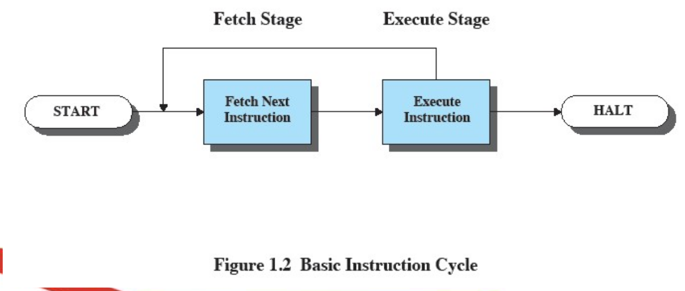
## Interupts
- interupt itu cuma signal berhenti (SIGINT) sementara yang dipake buat ngasi tau processor klo ada event yang lebih penting
- Fact: I/O itu mayoritas lebih pelan kerjanya dibanding ama processor
### 4 Jenis Interrupt
  - dari program :
    - terjadi klo programnya sendiri ada error (kek klo di cp (ARYA) itu tle to infinity jadi programnya sendiri interupt gara" gk bakal berhenti) (SIGINT jg bisa terjadi klo programnya sendiri jg error, kek memory overflow ato division by zero)
  - dari timer :
    - pre-planned ama processor klo programnya bakal di interrupt ama processornya expect buat programnya ke interrupt
    - ini exist klo OS nya mo operate pada interval tertentu 
    - cth: sebuah system clock nge hitung waktu per detik, klo sudah menyampai value tertentu, OS nya bakal interrupt clock nya untuk melakukan program yang lain
  - dari I/O
    - klo I/O nya kasi signal klo programnya sudah selesai (return 0) ato request dari user buat stop program nya (ctrl+c dari terminal)
    - note I/O itu gk neccesarily mean input output dari mouse ato keyboard ato dll. Bisa aja itu dari program output return  jadi langsung interrupt
    - bedanya interrupt ini ama interrupt dari program adalah klo interrupt dari program itu karena error yg terjadi di dalam programnya dan gk di expect oleh processor. klo interrupt dari I/O itu karena programnya udah selesai (walaupun return value nya bkn 0 (error), itu masih di return (end program) dan bisa dibilang programnya selesai)
  - dari Hardware Failure
    - contoh : processor pengen ke ambil data dari secondary memory (disk), tapi disk nya rusak jadi gk bisa ke fetch datanya, sehingga processor nya bakal interrupt
- Selama program berjalan, ia akan terus nge cek klo nge catch sebuah interrupt (if interrupt)
- klo ada interrupt, program bisa lakuin dua hal:
  - [suspend](#suspend) program
  - jalanin catch interrupt routine / nge call interupt handler(kek catch nya di try throw catch di c++)
    - Contoh yang lumayan complex : ada process yg request I/O operation, tapi I/O operation kan gk secepat/lebih lama dari processor jadi process nya sendiri masuk ke dalam wait/suspend state, nah pas I/O operation nya selesai, I/O module nya kasi signal ke processor klo I/O operation nya udah selesai, dari situ processor kirim SIGINT (signal interrupt) ke process yg lagi dlm wait status yg kirim pesan bahwa I/O udh siap.
## Instruction Execution/Flow with Interrupt
1. fetch instruction
2. execute instruction
   - interrupt enabled 
     - check interrupt
     - if interrupt, handle interrupt
     - back to fetch
   - interrupt disabled
     - back to fetch
3. loop from fetch, unless process done (halt)
<br/><br/>
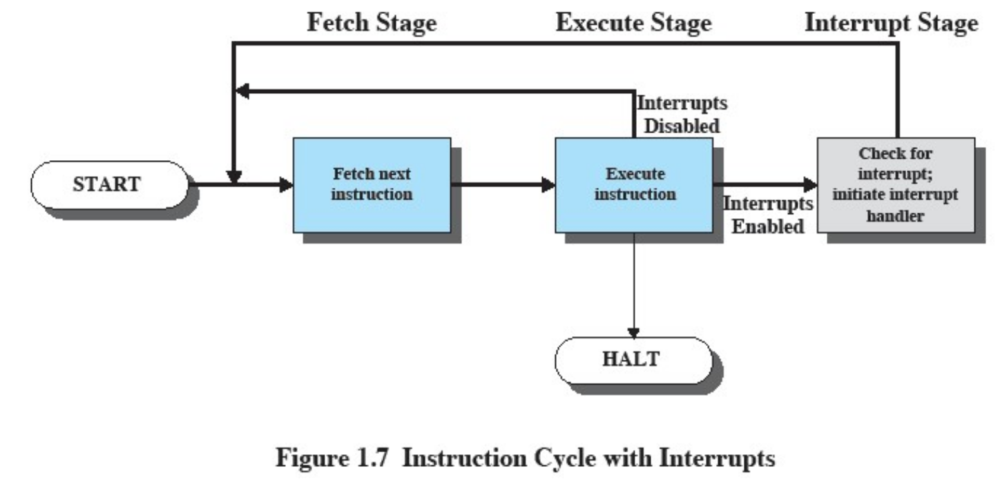
## Interrupt Processing
### Simple Interrupt Processing
note: ini gw copas dari ppt nya, `jadi mungkin ada beberapa kata yang gk gw pahami`
lol ini copilot yg bikin (i fucking love copilot)
1. Hardware side
   1. hardware demand sebuah interrupt
   2. processor selesaiin instruksi
   3. processor bilang ke hardware (i think?) klo dapat signal interrupt
   4. processor masukin PSW (processor status word) (variabel yg contain data status process (lagi jalan kah, wait kah, suspend kah?, dll) ) dan PC ke dalam control stack (stack yg buat nyimpen instruction sementara)>
   5. processor bikin PC baru buat interrupt handling
2. Software side
   1. simpen kondisi informasi yg ada di dlm process
   2. interupt process
   3. kembaliin kondisi informasi
   4. kembaliin PSW ama PC yg ada di control stack sebelumnya
### Sequential Interrupt Programming
1. Process beroperasi
2. Interruption muncul
3. Pertama dihandle oleh `Interruption Handler X`
4. IHX (Interruption Handler X) return/selesai handle interrupt
5. Selesai IHX, dilanjutkan oleh `Interruption Handler Y` (mereka bekerja pas after one another, gaada break)
6. IHY return/selesai handle interrupt
7. Selesai IHY, process berjalan lagi
<br/><br/>
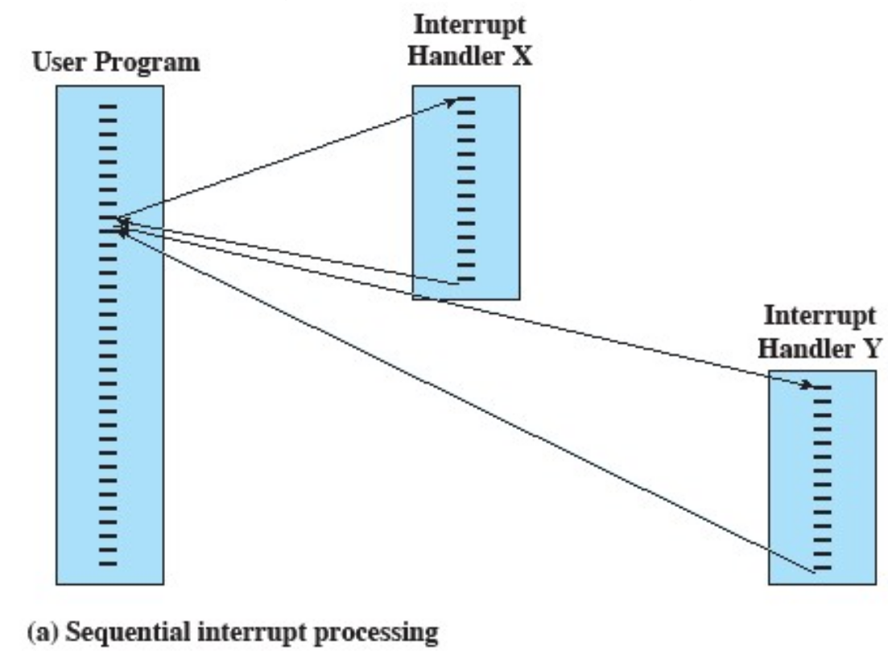
### Nested Interrupt Programming
1. Process beroperasi
2. Interruption muncul
3. Pertama dihandle oleh `Interruption Handler X`
4. Di dalam IHX ada interrupt lagi yang di handle oleh `Interruption Handler Y`
5. IHY selesai, kembali ke IHX
6. IHX selesai, kembali ke process
7. process berjalan lagi
<br/><br/>
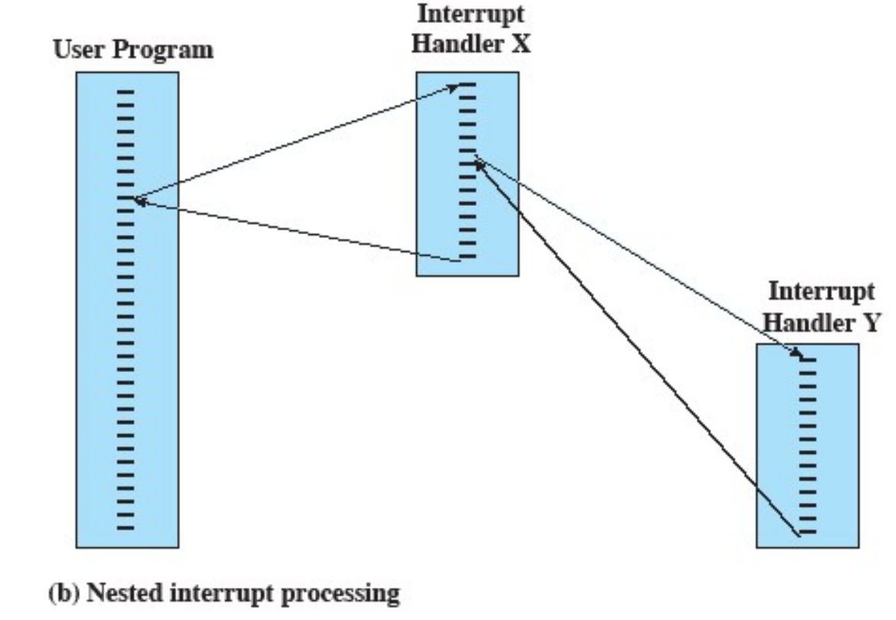
## Multiple Interrupt
### Prioritas
Di dalam contoh berikut ini, kita pakai kprioritas buat jelasin hierarki kepentingan interrupt
cuma perlu di note aja klo prioritas itu angka yg lebih kecil
<br/>
misalkan:
- process A (pA) memiliki interrupt prioritas 5
- process B (pB) memiliki interrupt prioritas 4
- process C (pC) memiliki interrupt prioritas 2

1. pA, pB, pC beroperasi
2. pA muncul interrupt prioritas 5
3. pA dihandle oleh IHX (Interruption Handler X)
4. Selama IHX lagi jalan, pB muncul interrupt prioritas 4
5. karena prioritas pB lebih tinggi dari pA, IHX di suspend dan pB dihandle oleh IHY terlebih dahulu
6. Selama IHY lagi jalan, pC muncul interrupt prioritas 2
7. karena prioritas pC lebih tinggi dari pB, IHY di suspend dan pC dihandle oleh IHZ terlebih dahulu
8. IHZ selesai, jadi IHY di unsuspended
9. IHY selesai, jadi IHX di unsuspended
10. IHX selesai, process berjalan lagi

## Multiprogramming
- Multiprogramming itu konsep processor memiliki lebih dari 1 program buat di execute sekaligus
- Sequence/urutan dari program mana yang harus diexecute itu berdasarkan [Prioritas](#prioritas) relatif mereka dan berdasarkan apakah mereka menggunakan I/O atau tidak
  - klo program A menggunakan I/O, dan program B gk, maka program B akan di execute terlebih dahulu
- Dalam multiprogramming, klo sebuah interrupt handler selesai, bisa aja handler nya return ke program lain (maksud program lain itu program yg bkn lagi di execute atau program yang bkn merupakan sumber interrupt)

## Memory Hierarchy
Memory pada dasarnya memiliki 3 atribut yg ngefek performance
- capacity
  - se brp banyak data 1 memory block bisa simpen
- access time
  - seberapa cepat data bisa di akses dari memory block
- cost
  - sebuah data di dalam sebuah memory block itu perlu brp banyak bit buat di simpen

Dari atribut ini, kita cuma bisa pilih min-max options :
1. Faster access time, greater cost per bit
  - contoh: Cache (capacity kecil, access time cepat, cost mahal)
2. Greater capacity, smaller cost per bit
  - contoh: RAM (capacity besar, access time relatif lambat, cost murah)
3. Greater capacity, slower access speed
  - contoh: HDD (hard disk) (kapasitas besar banget, access time lambat banget, cost murah)

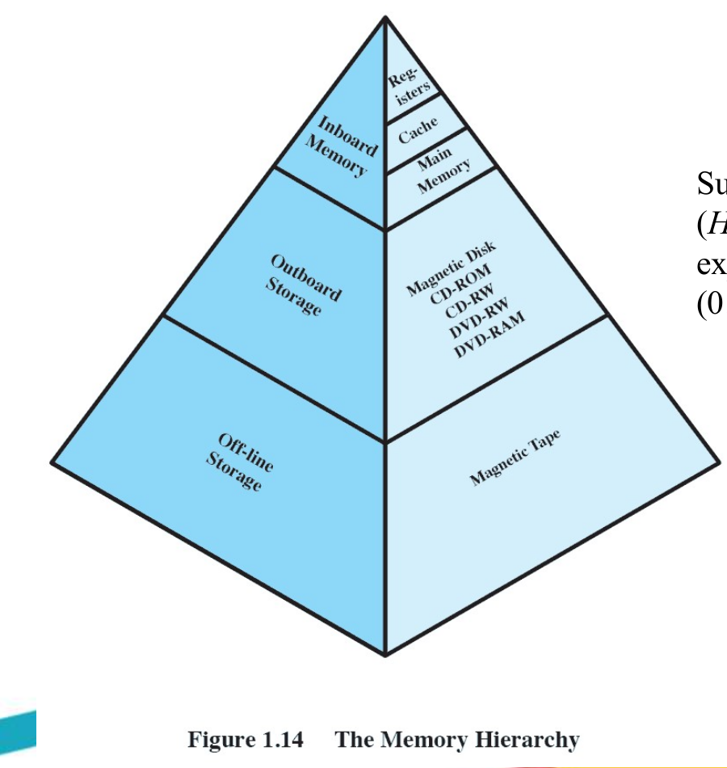
dari gambar diatas itu klo diperhatiin :
1. semakin ke bawah, cost per bit semakin murah
2. semakin ke bawah, capacity lebih besar
3. semakin ke bawah, access time nya lebih lama
4. Klo diperhatiin, itu jg semakin ke bawah, data-data yang biasanya di bawah hiearki itu lebih jarang dipanggil/kepake ama processor dibanding ama data-data di cache/atas hiearki
<br/><br/>
Bisa dibayangin di atas semua hiearki ini, ada processor dan processor panggil data di memory dari atas, jadi klo cache yg paling deket ama processor, bisa disimpulkan bahwa capacity nya kecil, access time nya cepet banget, dan cost nya mahal.

## Struktur Cache dan Main Memory
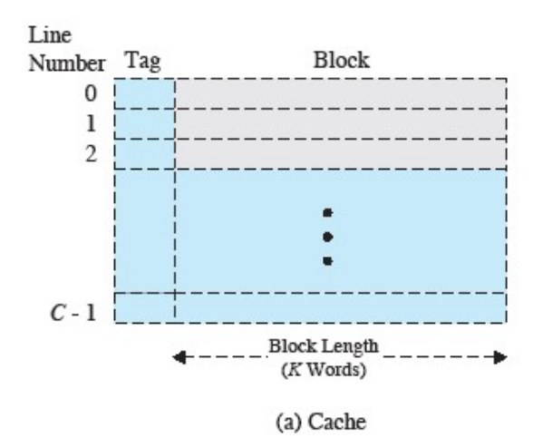
Tag merupakan semacam label/prefix untuk instant query block nya. jadi ketika processor mencari sebuah data, processor mencari dari tag
  - klo ketemu (tag hit), maka cache cuma perlu return block dari tag nya
  - klo gk ketemu (tag miss), maka cache jg perlu nge call lagi ke main memory buat ambil block nya tapi tag nya disimpe ke dlm cache jadi next time selalu tag hit.

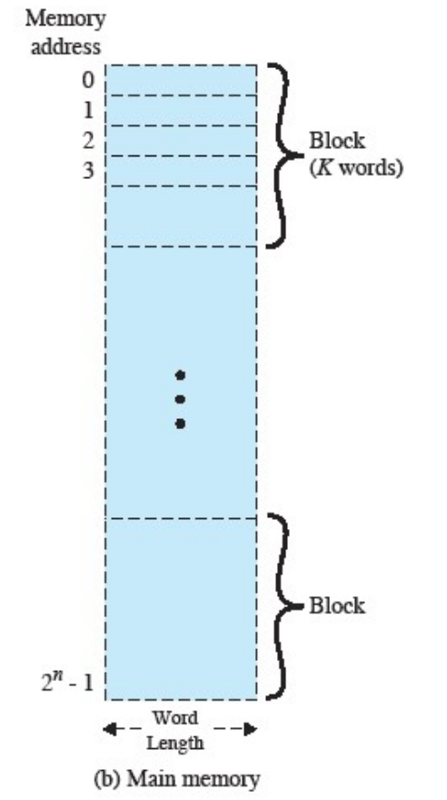
main memory intinya itu setor words (data) ke dalam block (memory block) dan setiap block itu punya address nya sendiri yg unique. jadi ketika processor nge call cache yg ngne call main memory untuk akses data, processor nge akses block nya bukan langsung data nya

## Prinsip Cache
- Cache mengandung sebuah porsi/sebagian dari main memory
- tiap kali processor mo akses memory, processor nge cek cache terlebih dahulu
  - klo ketemu, gk perlu call ke main memory
  - klo gk ketemu, data dipanggil dari main memory ke cache
    - data yang barusan dipanggil akan disimpen ke cache dan untuk future use case jadi gk perlu lagi panggil dari main memory
  - pokoknya after dipanggil data nya, pasti data reference nya ada di dalam cache after operation call nya
- cache sekecil-kecilnya, itu impactful ama penting banget buat performance
- jumlah data/word yg ke tuker diantara main memory ama cache itu depends entirely ke block size
  - block size yg lebih besar bisa bikin tag hit lebih sering terjadi sampai probabilitas
    - akan tetapi semakin besar size nya --> semakin banyak word yg masuk ke dalam cache --> semakin besar kemungkinan klo semua word yg di dlm block itu gk pake (redundant word yg masuk ke dalam cache) (perlu diinget tapi ada nya prinsip [spatial locality](#spatial-locality) dan [temporal locality](#temporal-locality))
- penentuan cache bakal setor block dmn
  - ketika sebuah block dibaca ke dalam cache, block lain harus di replace (inget block size itu universal, semua block size nya sama), harus ada algoritma buat nge cek block mana yg bakal dipake in the near future
  - semakin flexible algoritma mapping (alokasi block di address), semakin complex block-searching algorithm yg perlu dibikin
- block-replacement algorithm
  - Least-recently-used (LRU) algorithm
  - First in first out (FIFO) algorithm
  - least frequently used (LFU) algorithm
- prinsip cache untuk write block
  - bisa terjadi tiap kali ada block di cache yg di updated
  - bisa terjadi tiap kali block di dalam cache itu di replace
  -  block yg di update di dalam cache itu gk di sync ke main memory immediately until block nya di replace
### Cara Cache Beroperasi
1. Processor minta sebuah word dari cache
2. Cache cek apakah word nya ada di cache nya sendiri
   - klo ada, cache nge fetch word dari storage sendiri, lanjut ke 6.
   - klo gaada, cache nge call main memory untuk fetch wordnya, lanjut ke 3.
3. cache allocate space buat masukin word ke dalam cache nya
4. main memory kasi block of word ke cache
5. cache masukin block nya ke dalam storage 
6. cache return word nya ke processor

## Teknik Komunikasi I/O
### Programmed I/O
Note: kelemahan dari metode ini itu processor harus nge loop terus menerus buat nge cek apakah I/O module nya udah siap atau belum + nge cek apakah operasi I/O nya udah selesai atau belum. Jadi processor kerja ngerjain task yang kurang kerjaan.

1. Processor nge call I/O module
2. baca status I/O module
   - klo I/O module blom siap, nge loop check ampe udh siap
3. pas I/O udh siap, baca word dari I/O module.
4. write word ke main memory.
5. cek apakah operasi semuanya udh selesai?
   - klo blom, loop ke 2

### Interrupt-Driven I/O
1. I/O module kasi signal (interrupt) ke processor klo I/O module nya udah siap (processor kerjain yg lain jadi gk cek I/O module udh siap blom)
2. check status abis dari interrupt (signal) apakah I/O module sesungguhnya sudah siap
   - klo ternyata blom siap tapi I/O module sudah kirim interrupt tadi, error condition
3. processor nge call baca dari I/O module
4. write word ke main memory
5. processor nge ceck apakah operasi I/O nya udah selesai
   - klo blom, processor kasi signal ke I/O module buat siap-siap lagi, setelah kasi signal, processor kerjain yg lain
   - selagi processor kerjain yg lain, processor nunggu kedatangan interrupt dari I/O module lagi
## Footnote
### Spatial Locality
  - data yang di akses oleh processor itu biasanya berdekatan satu sama lain
  - jadi ketika sebuah word di akses, ada kemungkinan besar word lain yg berdekatan dengan word di akses itu juga bakal ikut kepake in the near future
### temporal locality
  - data yang di akses oleh processor itu biasanya di akses lagi di waktu yang dekat
  - jadi ketika sebuah word di akses, ada kemungkinan besar word yg sama bakal di akses lagi di waktu yang dekat

# PPT 2
### Requirements to be an Operating System
- bisa menyisipkan eksekusi dari be brp proses
- menyediakan/allocate resources/sumber daya ke proses dan mennjaga resource dari proses lain
- membolehkan proses untuk salinng bertukar informasi
- membolehkan proses untuk saling sinkronisasi
### Cara OS manage eksekusi aplikasi
1. resources komputer dibikin available ke banyak program
2. processor (cpu) itu dituker-tuker turn buat pake nya oleh banyak program
3. dari sini OS, bisa ngatur supaya processor ama I/O devices bisa dipake secara efisien
## Process
### Apa itu process
Banyak definisi :
- sebuah program yang sedang berjalan
- program yang sedang berjalan sekali (bisa program yang sama dijalankan barengan jadi itu terhitung 2 process)
- sebuah objek/entitas yang bisa dieksekusikan di dalam sebuah processor
- Sebuah set kegiatan kerja yang di-characterize dari eksekusi set instruksi, sebuah state/status, dan yang berhubungan dengan dengan sebuah set dari instruksi sistem
### Process itu terdiri dari apa
Main struktur process itu terdiri dari dua hal :
1. code program (yang mungkin bisa di share diantara proses)
2. data (informasi di dalam process)
Tapi di dalam process mereka jg ada semacam metadata/tags yang define process nya antara lain :
- identifier (id)
- state/status (running kah? suspend kah? dll)
- priority (priority kek 2, 4, 5, nge cek yg mana yg lebih penting buat di kerjakan)
- program counter (buat nge cek ini sudah di instruksi mana di dalam proses/program nya)
- memory pointer (lanjutan dari program counter, program counter hitung kita sudah di instruksi-i, memory pointer fetch instruksi-i dan dibaca dari memory pointer)
- context data (?) (mungkin buat nge cek apa aja yg udah di lakuin oleh process)
- I/O status information (?) (mungkin buat nge cek apakah I/O nya udah selesai ato belum)
- Accounting information (?) (mungkin buat nge track berapa lama proses berjalan, berapa banyak memory yg di pakai, dll)

Ini semua digabunng menjadi satu menjadi sebuah `Process Control Block`
Process control block itu bisa dibikin aama diatur oleh OS
Process control block bisa memiliki lebih dari satu proses

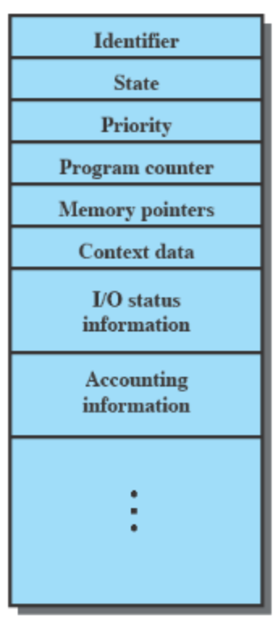

### Trace dari proses
- cara kerja dan kerja sebuah proses itu direkam lewat sebuah list yang mengandung sequence dari instruksi proses nya yang sudah di jalankan
- list ini disebut sebuah trace
- Dispatcher itu sebuah program kecil di dalam processor yang nge lakuin task switching process
  - dispatcher itu penting soalnya itu yg determine di dalam trace itu instruksi terakhir itu apa sebelum process nya di switch
### Eksekusi program menggunakann dispatcher
dispatcher nge switch process pake yg namanya timeout, jadi klo process nya udah selesai/sebaiknya diganti, dispatcher nge switch ke process lain
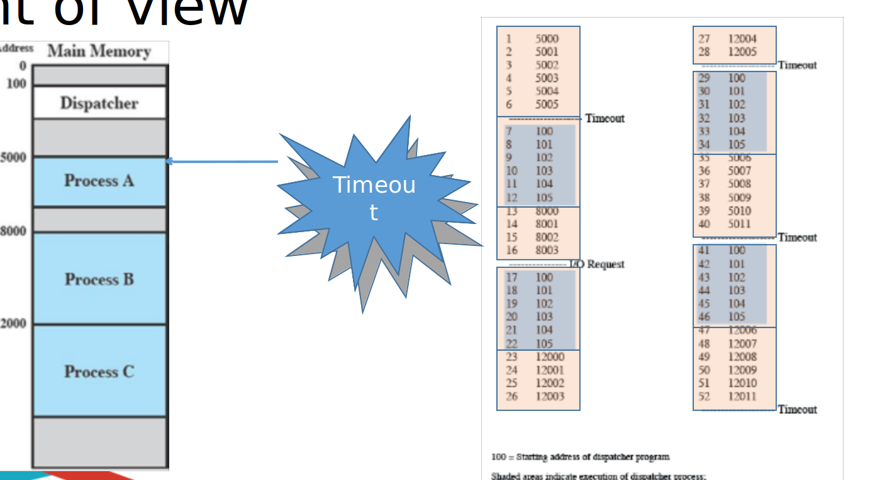

perhatikan di gambar itu dispatcher liat trace dari progres A untuk lanjutin process dari start timeout nya
## State Process
### Two-State Process Model
process cuma punya dua state pada inti dasarnya :
- running
- not running
  - bisa jadi process nya lagi di suspend
  - bisa jadi process nya lagi di wait
  - bisa jadi process nya lagi di ready
  - bisa jadi process nya lagi di terminate
  - pokoknya pause nya bisa berasal dari banyak hal
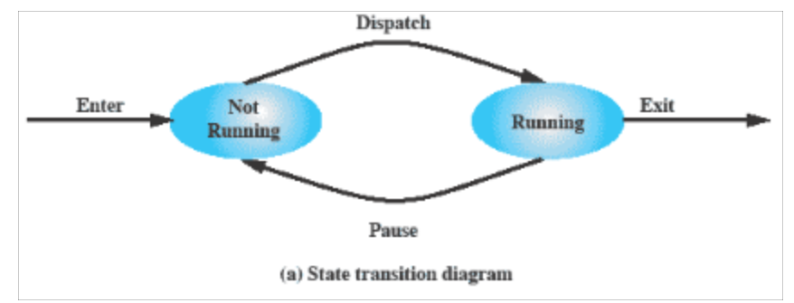

### Process Creation and Termination Causes
| Creation | Termination |
|----------|-------------|
| batch (shell) job baru | complete ampe end of job |
| interactive login (login ke user) | memory unavailable (bisa aja user minta shutdown-->normal, tapi juga bisa klo memory unavailable laptop mati user session) |
| proses yang dibikin ama OS buat akomodasi/provide service | protection error (process gk punya permission untuk akses sebuah file)|
| process yang dibikin dari process lain | Operator or OS Intervention (OS nya yang tentuin klo ini process sudah waktunya buat di terminate) |

#### Process Creation 
OS urusin semua process (OS ada bikin data structure buat manage process), tapi gk cuma OS doang yang bisa bikin process baru <br/>

Sebuah proses bisa bikin proses baru yang namanya **Proses Spawning**

dlm process spawning ada dua term :
- Parent process : process yang bikin process baru
- Child process : process baru yang dibikin ama parent process

#### Process Termination
Memento mori (sebuah process yang dicreate pasti ada terminationnya)
yang terminate bisa berasal dari banyak sumber :
- instruksi HALT yang bikin signal interrupt ke OS
- user request/action (logging off, alt+f4, ctrl+c)
- process error/fault
- parent process nge call buat termination process nya
### Five-State Process Model
1. New
   - process baru yang dibikin
2. Ready
   - process yang siap buat di execute
   - process sudah siap dijalankan cuma perlu giliran yang dikasih ama dispatcher
3. Running
   - process yang lagi di execute
   - timeout adalah penentu kapan process ini harus di switch dari dispatcher
   - klo process mo nunggu for something, daripada nunggu di processor, processor kirim process nya ke blocked state aja daripada resources processor dipake buat nungguin process yang gk kerja
4. Blocked
   - process yang lagi nunggu event
   - penentu kapan process ini harus di suspend untuk nunggu sebuah event (mungkin nunggu I/O device dll). 
   - setelah event selesai, process balik ke ready state 
   - proses balik ke ready state soalnya pas process lagi di blocked state, dispatcher switch ke process lain buat kerja, jadi pas process yg di blocked selesai, dia mesti tunggu giliran lagi dari dispatcher
5. Exit
   - process udh selesai jadi termination
   - memento mori, semua program pasti ada terminantion nya

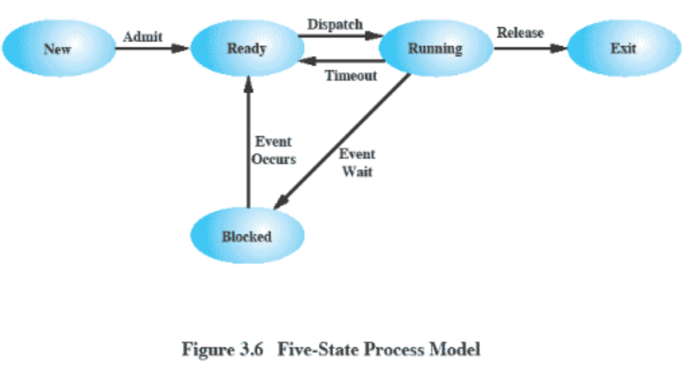

### Data Structure in Process Managing
#### Two Queue
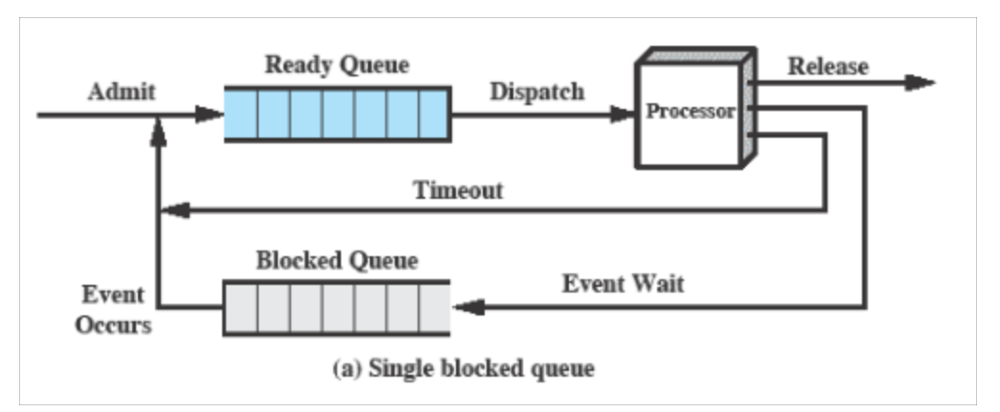
disini cuma 2 queue dipake :
- ready queue
  - assuming dispatcher cuma pake prinsip FIFO buat scheduling programnya
- blocked queue
  - universal blocked queue, semua process yg tunggu event masuk ke dalam queue ini (gk peduli event yg beda, yg penting process nya lagi nunggu event jadi masuk ke queue ini)
  - bisa dinalarin klo metode ini jg masih kurang efektif soalnya bisa aja 1 event udh selesai, tapi gara" prinsip FIFO, process nya gk bisa keluar dari blocked queue.
#### Multiple Queue
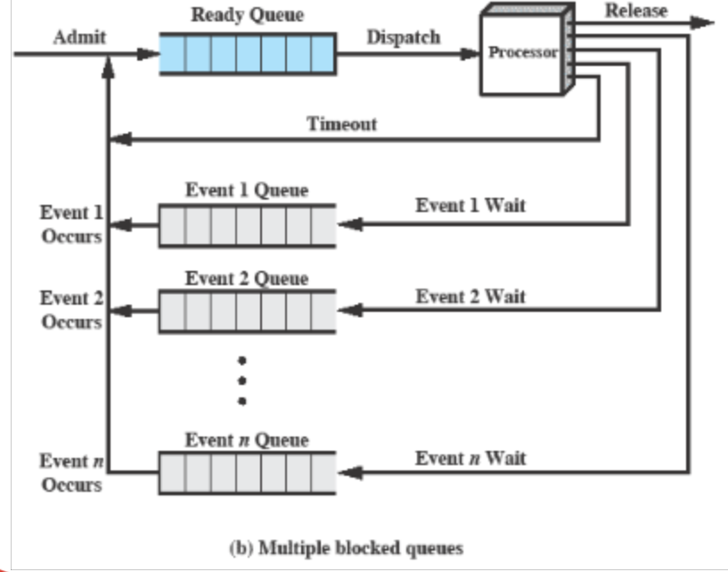
mirip kek two queue, cuma setiap event memiliki queue nya sendiri. <br/><br/>
klo pake metode ini, kelemahan two queue gaada gara" setiap event punya queue nya sendiri, jadi klo event nya udah selesai, process nya bisa langsung keluar dari queue nya dan masuk ke ready queue dan prinsip FIFO tidak menghambat process nya buat masuk ke ready queue

### Suspend States
kan klo process nunggu buat I/O itu dimasukin ke dalam blocked queue, akan tetapi bisa saja I/O nya lama banget jadi daripada blocked queue nya sendiri juga lama, mending dimasukin saja process nya ke dalam suspend state. <br/><br/>
suspend state itu mirip kek blocked state cuma bedaya itu suspend state itu lokasi nya di secondary memory (disk/SSD) jadi gk membebani main memory. <br/><br/>
di dalam suspend, ada dua state baru :
- Blocked/Suspend : process yang nunggu event dan pemindahan dari memory to storage/disk
- Ready/Suspend : process yang siap buat di execute dan pemindahan dari storage/disk to memory

#### One Suspend State
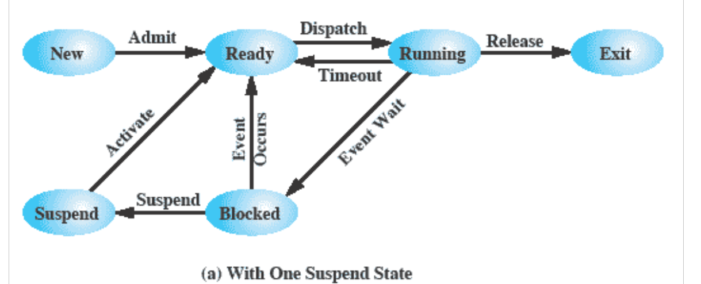
klo diperhatiin, ini kurleb sama persis ama (five-state-process-model)[#Five-State-Process-Model] cuma bedanya itu process yang di suspend itu di pindahin ke dalam disk/secondary memory

#### Two Suspend State
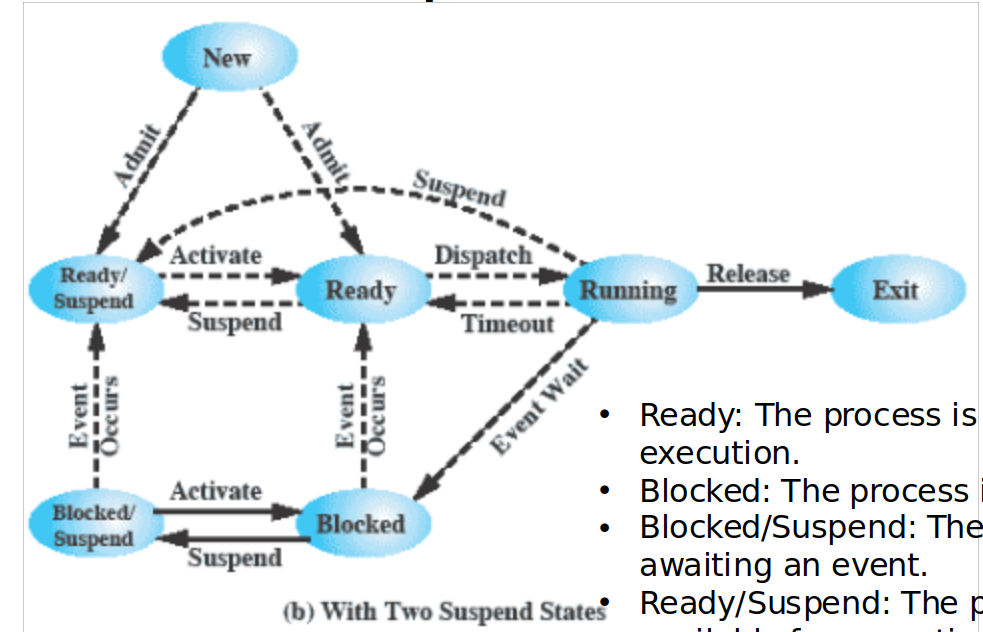
tambahan fitur dari one suspend state cuma suspend lebih diperjelas.
- skrng klo bikin new process, bisa langsung masukin dlm ready/suspend state
- klo running process, bisa langsung masukin ke ready/suspend state untuk nunggu event
- klo ada running process yg mungkin makan resource processor, bisa saja dimasukin ke ready/suspend state, yaitu artinya cuma process di taruh aja di disk/secondary memory padahal gk nunggu event, tapi pas dipindahin ke main memory, siap buat di execute
- jadi bedannya ready/suspend state ama blocked state itu klo blocked itu terletak di main memory dan juga nunggu event. Sedangkan klo ready/suspend itu gara" process nya gk nunggu event, tapi gk di execute, jadi process nya di taruh di disk/secondary memory buat hemat resource.

#### Reasons for Suspend State
| Reason | Description |
|--------|-------------|
| Swapping | process di taruh ke disk buat hemat resource |
| Alasan OS Reason | OS curiga process ini bikin masalah|
| User Request | user minta process ini di suspend (cth breakpoint di debugging vscode)|
| Timing | sebuah process yang di jalan secara periodic (jadi mending taruh di suspend aja buat nungguin event berikutnya) (cth: cronjob)|
| Parent Process Request | parent process minta processor buat suspend process ini, mungkin buat modify ato koordinasi proses bersamas child proses lain, dll |

(UNFINISHED, IM SORRY)

# SEMAPHORE
klo semWait itu artinya kita mau taruh process di block queue

klo semSignal itu artinya kita mau keluarin process dari block queue ke ready queue

semWait decrement semaphore value dengan arti klo semaphore value nya 0, process akan di block

semWait decrement artinya misal binary klo semaphore = 0 artinya itu bilang jan maju ke ready dulu

semSignal increment artinya misal binary klo semaphore = 1 artinya itu bilang process yg ada di blocked queue, langsung lanjut aja

di non-binary semaphore primitive
semSignal nge cek klo itu negative numbers gk, soalnya klo negative number semaphore nya, artinya ada process yg lagi di dlm blocked queue, klo semaphore nya positif number artinya gk ada process yg di blocked queue

di binary semaphore, klo semaphore = 0 di semWait, artinya sudah ada process di dalam blocked queue, jadi tinggal tambahin lagi, klo semaphore = 1, itu artinya cuma minta ganti value semaphore (suruh queue buat nge block process lagi)

di binary semaphore, klo di dalam blocked queue kosong, artinya gaada process yg di queue terus ini semaphore diangkat aja jadi 1 soalnya blom ada perintah buat block process. Sedangkan klo  ada process di dalam blocked queue, itu semSignal cuma admit/unblock 1 process yg di block queue jadi masuk ke dalam ready queue.

# MESSAGE PASSING
reader-side
 1. reader minta request buat baca file
 2. dia nunggu ampe dapat msg di mailbox (klo dapet message di mailbox artinya di admit)
 3. baca file
 4. kirim ke controller klo udh selesai baca file

writer-side
1. writer minta request buat giliran write file
2. dia nunggu ampe dapat msg di mailbox (klo dapet message di mailbox artinya di admit)
3. write file
4. kirim ke controller klo udh selesai write file

controller-side
note klo count itu: 
- angka positif 100 : **blom ada yg request read/write file**
- angka positif < 100 : **ada reader yg request baca, tapi gaada writer yg request write**
- angka 0 : **ada writer yang request write file dan gaada reader yang read file**, gk bolehin apapun request (writer request, reader request --> semuanya diignore)
- angka negatif : **ada reader yg request baca, ada writer yang juga request write**, writer wait dulu ampe semua reader selesai baca file

sebuah scenario dmn reader lagi baca file, terus tiba tiba writer request write file :
- writer disuruh jan write dulu
- nunggu ampe semua reader dlm file itu selesai baca (count == 0), selagi itu controller tunggu message selesai baca dari reader, klo 1 message selesai baca, maka count di increment ampe 0

cth scenario :
1. Init (`count = 100`)
2. 3 reader request baca file `(count = 100 -3 = 97`)
3. pas reader lagi read file, ada writer yang request write (`count = 97 - 100 = -3`)
4. controller sadar itu negative number, jadi minta writer buat nunggu dulu ampe controller dapet 3 message finished dari reader
```c
while (count != 0) {
  semWait(writer);
}
```
  4.1 ketika controller dapet 1 message finished dari reader, count di increment (`count = -3 + 1 = -2`)
5. Ketika count = 0, artinya udh gaada reader lagi yang baca file, writer mulai write file 
  - Selama writer write file, controller gk baca request apapun (gk baca request read, dan gk baca request write)
6. controller nunggu dapet message finished dari writer yg nge write file, lalu baru `count = 100` (semua process udah selesai)

perlu diperhatiin itu klo 2 writer minta write file. controller admit 1 writer, terus pure nungguin writer di dalam file nya selesai. baru terima request writer 1 lagi. klo writer 1 selesai, baru writer 2 di admit

juga note lagi :
misalkan ada 2 write request dan n (n > 0) read request, controller kasi writer prioritas paling tertinggi dulu (kasi 2 writer dulu baru kasi n reader)
- writer-priority disini gara" layout code di controller nya, itu dia else if writer_request dulu baru else if reader_request, klo reader_request dulu sebelum writer_request maka controller itu punya reader-priority instead of writer-priority